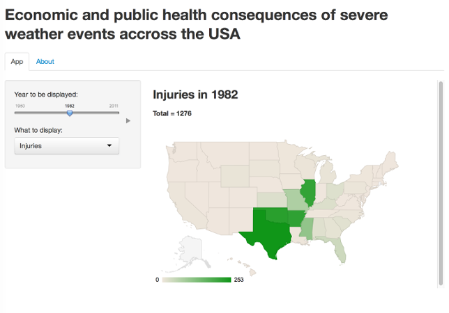
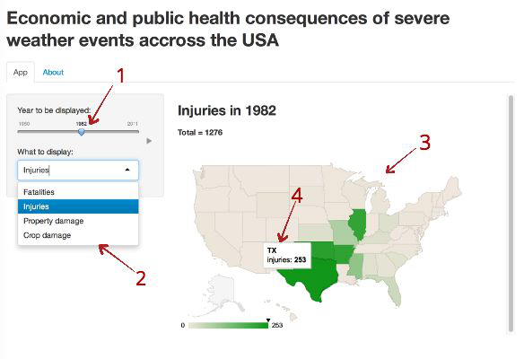

## About application


1. This is the [link](https://ilmirashaim.shinyapps.io/project/) to the application.
2. This application is based U.S. National Oceanic and Atmospheric Administration's (NOAA) [storm database](https://d396qusza40orc.cloudfront.net/repdata%2Fpeer2_doc%2Fpd01016005curr.pdf).
3. After some preprocessing and aggregating the data the [original dataset](https://d396qusza40orc.cloudfront.net/repdata%2Fdata%2FStormData.csv.bz2) was converted to [new dataset](https://dl.dropboxusercontent.com/u/72511223/aggregatedStormData.csv). This last dataset is used by the app.
```{r}
url="https://dl.dropboxusercontent.com/u/72511223/aggregatedStormData.csv"
data <- getURL(url, ssl.verifypeer=0L, followlocation=1L)
data <- read.csv(text=data)
```
4. The application can visualise 4 characteristics of severe weather events across the U.S. for each year from 1950 to 2011. These characteristics are: 
```{r, echo=FALSE}
names(data)[4:dim(data)[2]]
```

--- .class #id 

## How does it look like?

<p>Here is an screenshot of working app. </p>
<p>It shows a number of injuries caused by severe weather events in 1982 in each state.</p>

</img>

---
## How does it work?
<div style="float:left;width:400px;">
<p>Very simple  </p>
<ol type="1">
<li>You choose the year with first slider.  </li>
<li>You choose the characteristic. </li>
<li>Now you should see the map with states colored depending on the sum of characteristic and total sum on the top.  </li>
<li>You can hover any state to see the exact value of characteristic.</li>  
</ol>
</div>
<div style="margin-left:420px;">
    </img>
</div>

---
## Why i should use this app?

<p>If your are going to do some data analysis with this dataset you can use the app to visualise and understand the data better.  </p>
<p>Or if you live in USA you can use the app to choose what state you can move to for avoiding bad consequences of severe weather.</p>
